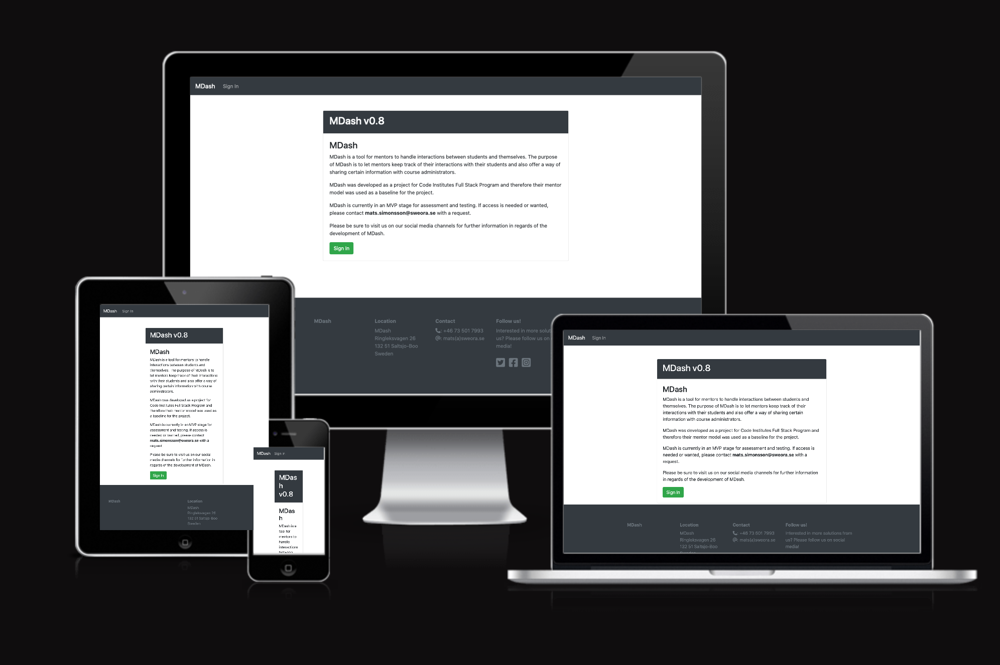
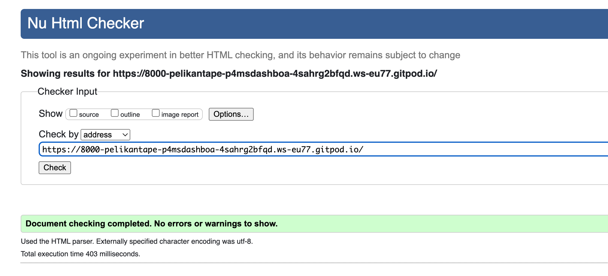
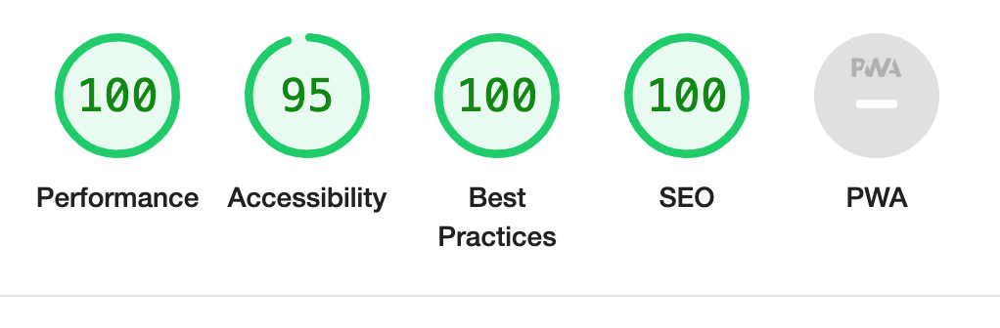
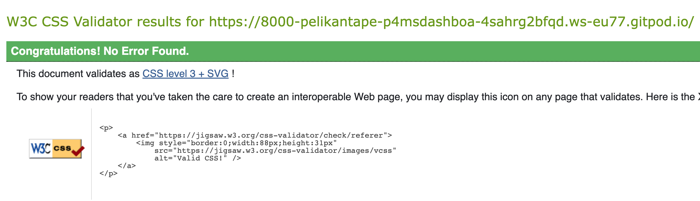

# MS-Dashboard

# The purpose with this project

MDash is a tool that is supposed to help mentors in their interactions with students. MDash was developed as a student project for the Code Institute Full Stack Program. In it’s blueprint MDash is an extensive tool. This MVP was developed to be used for testing to be able to further assess functionality and to create the next steps for the applications road map.MDash offers Mentors a way to store detailed information regarding their sessions they hold with students. It also allows them to see their students and make quick notes that can be used to create the final summary.

All the information that Mentors write is automatically shared with the course administrator.

During the MVP no external registrations of users is allowed so users that want to test need to contact the system administrator in order to receive access.

Required technologies for this project: 

 - HTML, CSS, JavaScript, Python+Django
 - Relational database

A live version of this project can be found at this url: https://ms-dashboard2022.herokuapp.com/

# Table of Content

+ [UX](#ux "UX")
  + [User Demographic](#user-demographic "User Demographic")
  + [User Stories](#user-stories "User Stories")
    + [User reading](#user-reading "User reading")
    + [User submitting](#user-submitting "User submitting")
  + [User Goals](#user-goals "User goals")
  + [Project Requirements](#project-requirements "Project Requirements")
  + [Design diagram](#design-diagram "Design diagram")
+ [Features](#features "Features")
  + [Existing Features](#existing-features "Existing Features")
    + [Feature 1](#feature-1 "Feature 1")
  + [Features Left to Implement](#features-left-to-implement "Features Left to Implement")
+ [Languages used](#languages-used "Languages used")
  + [Frameworks and libraries and tools](#frameworks-and-libraries-and-tools "Frameworks and libraries and tools")
  + [Installed packages](#installed-packages "Installed packages") 
+ [Testing](#testing "Testing")
  + [Bugs during development](#bugs-during-development "Bugs during development")
  + [Validator Testing](#validator-testing "Validator Testing")
  + [Unfixed Bugs](#unfixed-bugs "Unfixed Bugs")
+ [Deployment](#deployment "deployment")
+ [Content](#content "Content")
+ [Credits](#credits "Credits")

## UX

### User Demographic

This application is supposed to serve a purpose for mentors that want to ease their interactions with students. Mentors that wants to keep all there information regarding a student in one place at at the same time want to share the information with the course administrators.

### User Stories

The following user stories has been implemented in the project. User Stories are based on two types of users, the course manager and the mentor. More user stories will be implemented in future versions.

Admin

As a **course manager/admin** I can **create a mentor profile** so that **the mentor can use the dashboard as a tool**

As a **course manager/admin** I can **view a list of mentors** so that **I can select one and connect the mentor to a student**

As a **course manager/admin** I can **view a list of mentors** so that **I can select one to read details, edit or delete the mentor if needed.**

As a **course manager/admin** I can **create a student profile** so that **I can add the student to a mentor**

As a **course manager/admin** I can **view a list of students** so that **I can select one to read details, edit or delete the student if needed.**

As a **course manager/admin** I can **select a student** so that **I can change the students selected mentor**

Mentor

As a **mentor** I can **view a list of students** so that **I can see the ones assigned to me**

As a **mentor** I can **select a student from the list of students** so that **I can see the students profile**

As a **mentor** I can **read a student profile** so that **I can see the students name, email and course start date and end date**

As a **mentor** I can **see a list of sessions in the student profile** so that **I can see the ones that have been conducted**

As a **mentor** I can **create a session for a student** so that **I can write and save the date for the session, the duration of the session and add notes about the session**

As a **mentor** I can **select session notes** so that **I can share them with the course manager**

As a **mentor** I can **select a session** so that **I can edit the session details and delete it if necessary**

As a **Mentor** I can **search for my students** so that **I can get quick and easy access to their profiles**

As a **Mentor** I can **log the time I spent on a session** so that **I can get total time spent on students**

As a **Mentor** I can **visit my profile page** so that **I can see the total time I spent on sessions**

### Project Requirements

To be clarified

### Design diagram

To be clarified

[Back to top](#ms-dashboard)

## Features 

To be added

### Existing Features

To be added

#### Feature 1

To be added

## Features Left to Implement

To be added

[Back to top](#ms-dashboard)

## Languages used

 - HTML5
 - CSS3
 - Javascript
 - Python
 - Django
 - SQL - Postgres

### Frameworks and libraries and tools

 - GitPod
 - GitHub
 - Django
 - Bootstrap
 - DrawSQL
 - Jquery

### Installed packages

 - asgiref==3.5.2
 - cloudinary==1.29.0
 - dj-database-url==0.5.0
 - dj3-cloudinary-storage==0.0.6
 - Django==3.2.13
 - django-allauth==0.51.0
 - django-crispy-forms==1.14.0
 - gunicorn==20.1.0
 - oauthlib==3.2.0
 - psycopg2==2.9.3
 - PyJWT==2.4.0
 - python3-openid==3.2.0
 - pytz==2022.1
 - requests-oauthlib==1.3.1
 - sqlparse==0.4.2

## Testing 

All testing in this project has been done manually during the development process, the project has not followed the principles of test driven development. Testing has for the most part followed the track of the user stories. Everytime a user story is concluded testing has occured. Each version has been tested before commited and the testing has been conducted in these steps:

 - Code validation
 - Functionality (That it actually does what it is supposed to)
 - Bug elimination
 - CRUD (On those sections when this occur)

During the development process a lot of bugs has been discovered. A portion of them are presented in the Bugs during development section.

Functionality testing has been conducted by the author of the project together with selected class mates and selected resources that are aknowledged in the Credit section.

### Bugs during development

List contains bugs encountered during development and solved.

### Validator Testing 

Testing with https://validator.w3.org/ shows no errors on html:

Testing with lighthouse gives the following results:

Testing and validating using pep8 validations tools:

All python code in this project is not perfect. Some are showing errors of lines that are to long, especially in settings.py and in other files that are installed as part of django. The majority of the problems are not causing errors and are not from code that I actually wrote. Therefore it's not possible to produce a clean slate of a perfect record since some of the code is not perfect but still functional.

Testing with https://jigsaw.w3.org/css-validator/ shown no errors on CSS:

### Unfixed Bugs

- URLS of AllAuth is broken and returns error
  - Update settings.py with 'allauth.socialaccount' as installed app to correct

 [Back to top](#ms-dashboard)

## Deployment

The site was deployed to Heroku. The steps to deploy are as follows:

The project was developed using Gitpod with regular commits to Github. In order to deploy to Heroku a requirements.txt file needs to be created
and it is important that the database is created in Heroku so that the database can be migrated before actual deployment.

Before migrating the database I used the following cofigvars:

 - key: SECRET_KEY | value
 - key: PORT | value
 - key: DATABASE_URL | value

All values was provided by Heroku and I used env.py to store the values for my project and used the variables for the values in settings.py for the Database url and secret key. Heroku also needs to be set as an allowed host in settings.py (please see settings.py in this repository for details).

Migration of database can be done prior of deployment. If set up correctly your environment will use Herokus database and not local sqlite.

Before the push to GitHub a procfile needs to be created with the content: web: gunicorn msdashboard2022.wsgi

After deployment push to Github the project was deployed from Heroku using the "Deploy" tab.

After those steps were taken the application was deployed at the following link: https://ms-dashboard2022.herokuapp.com/

## Content 

All content in the app and on the site has been produced by the author of the project.

## Credits 

### For code inspiration, design inputs, help and advice.

### Acknowledgment
