# MS-Dashboard

# The purpose with this project

MDash is a tool that is supposed to help mentors in their interactions with students. MDash was developed as a student project for the Code Institute Full Stack Program. In it’s blueprint MDash is an extensive tool. This MVP was developed to be used for testing to be able to further assess functionality and to create the next steps for the applications road map.MDash offers Mentors a way to store detailed information regarding their sessions they hold with students. It also allows them to see their students and make quick notes that can be used to create the final summary.

All the information that Mentors write is automatically shared with the course administrator.

During the MVP no external registrations of users is allowed so users that want to test need to contact the system administrator in order to receive access.

Required technologies for this project: 

 - HTML, CSS, JavaScript, Python+Django
 - Relational database

A live version of this project can be found at this url: https://ms-dashboard2022.herokuapp.com/

# Table of Content

+ [UX](#ux "UX")
  + [User Demographic](#user-demographic "User Demographic")
  + [User Goals](#user-goals "User goals")
  + [User Stories](#user-stories "User Stories")
    + [Admin](#admin "Admin")
    + [Mentor](#mentor "Mentor")
  + [Project Purpose](#project-purpose "Project Purpose")
  + [Design diagram](#design-diagram "Design diagram")
+ [Features](#features "Features")
  + [Existing Features](#existing-features "Existing Features")
    + [Sign In](#sign-in "Sign In")
    + [List of students](#list-of-students "List of students")
    + [Student details](#student-details "Student details")
    + [List of sessions](#List-of-sessions "List of sessions")
    + [Create session](#create-session "Create session")
    + [Session details](#session-details "Session details")
    + [Edit session](#edit-session "Edit session")
    + [Delete session](#delete-session "delete-session")
    + [Create note](#create-note "Create Note")
    + [Search student](#search-student "Search Student")
    + [Search results](#search-results "Search Results")
    + [Time Report](#time-report "Time Report")
    + [Course Admin Features](#course-admin-features "Course Admin Features")
  + [Features Left to Implement](#features-left-to-implement "Features Left to Implement")
+ [Languages used](#languages-used "Languages used")
  + [Frameworks and libraries and tools](#frameworks-and-libraries-and-tools "Frameworks and libraries and tools")
  + [Installed packages](#installed-packages "Installed packages") 
+ [Testing](#testing "Testing")
  + [Bugs during development](#bugs-during-development "Bugs during development")
  + [Validator Testing](#validator-testing "Validator Testing")
  + [Unfixed Bugs](#unfixed-bugs "Unfixed Bugs")
+ [Deployment](#deployment "deployment")
+ [Content](#content "Content")
+ [Credits](#credits "Credits")

## UX

### User Demographic

This application is ment for:
 - All mentors that wants a tool to store information regarding their interactions with students.
 - All Course Administrators that wants to pair mentors and students and have access to the information.

### User Goals

To have all information stored in one place that is related to the interactions between mentor/students and mentors/course administrators. To have a good overview of how many sessions and interactions that has taken place and also a place to store information regarding these interactions in the form of notes.

### User Stories

The following user stories has been implemented in the project. User Stories are based on two types of users, the course manager and the mentor. More user stories will be implemented in future versions.

#### Admin

As a **course manager/admin** I can **create a mentor profile** so that **the mentor can use the dashboard as a tool**

As a **course manager/admin** I can **view a list of mentors** so that **I can select one and connect the mentor to a student**

As a **course manager/admin** I can **view a list of mentors** so that **I can select one to read details, edit or delete the mentor if needed.**

As a **course manager/admin** I can **create a student profile** so that **I can add the student to a mentor**

As a **course manager/admin** I can **view a list of students** so that **I can select one to read details, edit or delete the student if needed.**

As a **course manager/admin** I can **select a student** so that **I can change the students selected mentor**

#### Mentor

As a **mentor** I can **view a list of students** so that **I can see the ones assigned to me**

As a **mentor** I can **select a student from the list of students** so that **I can see the students profile**

As a **mentor** I can **read a student profile** so that **I can see the students name, email and course start date and end date**

As a **mentor** I can **see a list of sessions in the student profile** so that **I can see the ones that have been conducted**

As a **mentor** I can **create a session for a student** so that **I can write and save the date for the session, the duration of the session and add notes about the session**

As a **mentor** I can **select session notes** so that **I can share them with the course manager**

As a **mentor** I can **select a session** so that **I can edit the session details and delete it if necessary**

As a **Mentor** I can **search for my students** so that **I can get quick and easy access to their profiles**

As a **Mentor** I can **log the time I spent on a session** so that **I can get total time spent on students**

As a **Mentor** I can **visit my profile page** so that **I can see the total time I spent on sessions**

### Project Purpose

From Code Institutes assessment guide:

In this project, you'll build a Full-Stack site based on business logic used to control a centrally-owned dataset. You will set up an authentication mechanism and provide role-based access to the site's data or other activities based on the dataset.

### Design diagram

To be clarified

[Back to top](#ms-dashboard)

## Features 

Mdash consists of two main features for Mentors:

Add information regarding a student
Add information regarding a session with a student

Course administrators main features are:

Add a mentor
Add a student
Pair a mentor and a student
Take part of information from mentors

### Existing Features

#### Sign In

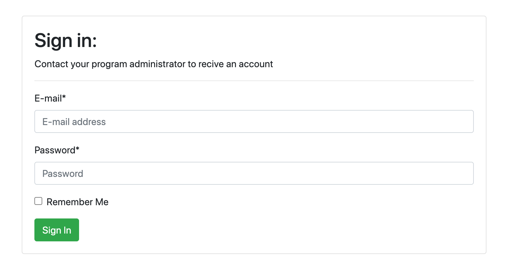

#### List of students

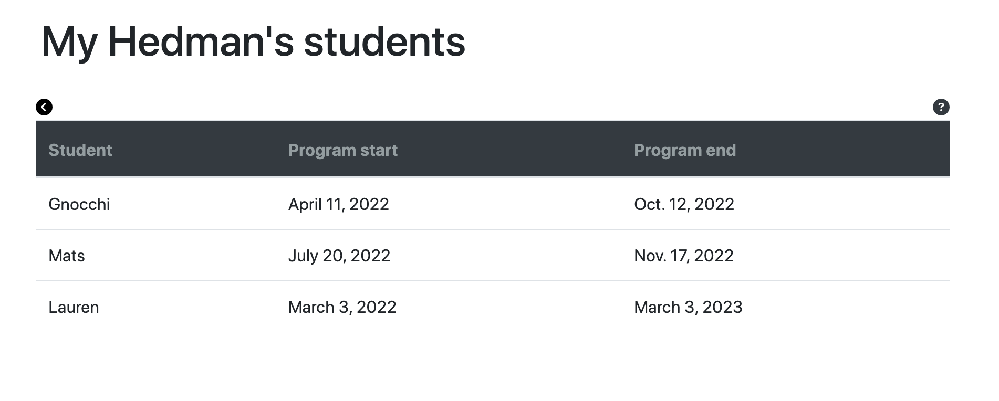

#### Student details

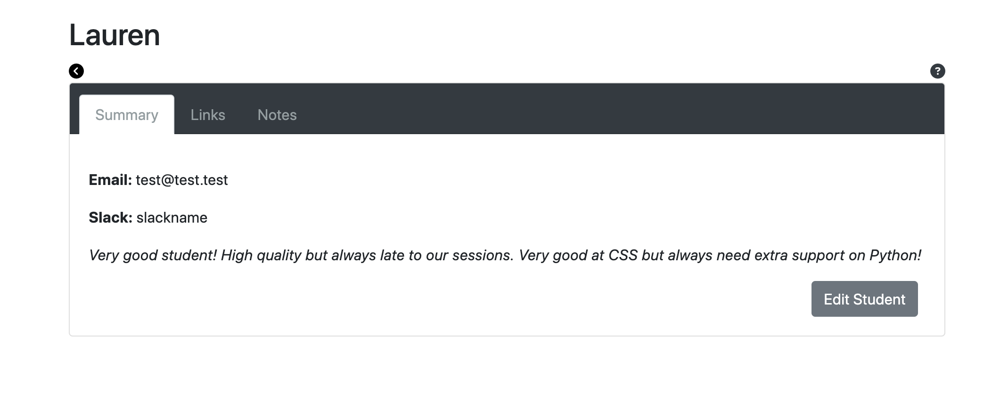
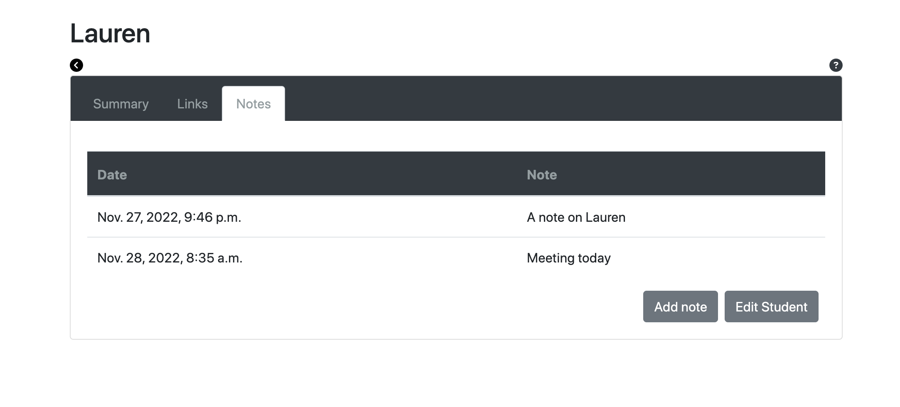

#### List of sessions

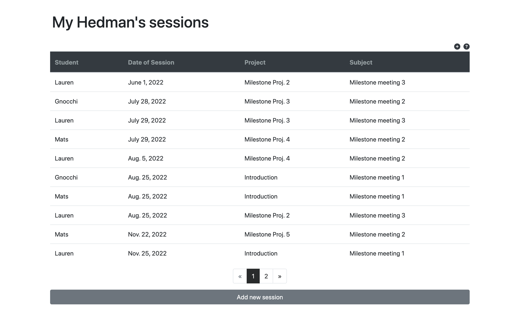

#### Create session

#### Session details

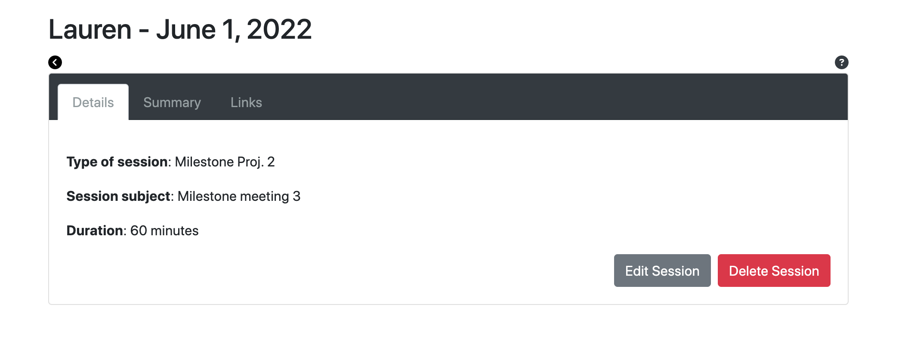
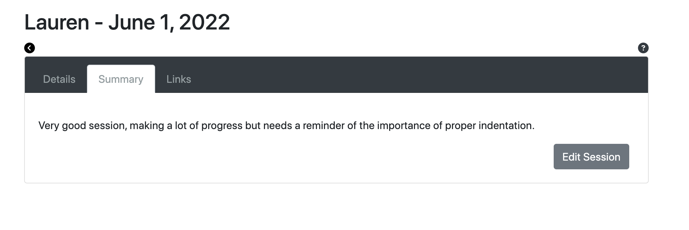

#### Edit session

#### Delete session

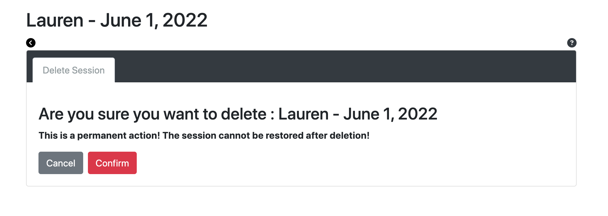

#### Create note

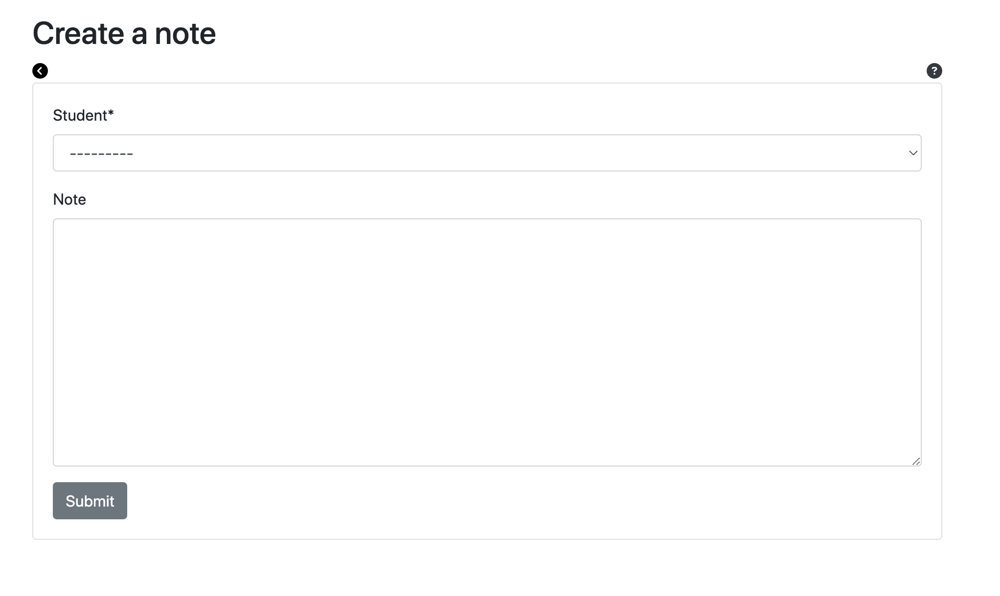

#### Search student

#### Search results

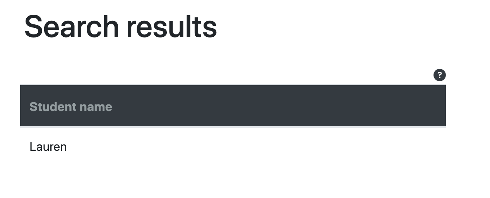

#### Time report

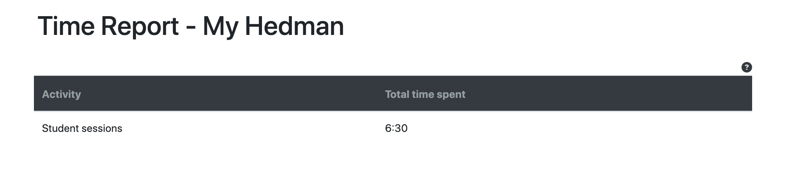

#### Course Admin Features

Course administrators can do all the features as mentors in front-end. The course administrators use the django admin pane in this mvp for student and mentor creation. They also use the admin pane for pairing of students and mentors by creating a student-mentor-card.

## Features Left to Implement

Following features are planned_

 - Password reset function using email
 - Export of time report as csv
 - Registration function for students
 - Front end for Course administrators
 - File repository for upload on student profiles

[Back to top](#ms-dashboard)

## Languages used

 - HTML5
 - CSS3
 - Javascript
 - Python
 - Django
 - SQL - Postgres

### Frameworks and libraries and tools

 - GitPod
 - GitHub
 - Django
 - Bootstrap
 - DrawSQL
 - Jquery

### Installed packages

 - asgiref==3.5.2
 - cloudinary==1.29.0
 - dj-database-url==0.5.0
 - dj3-cloudinary-storage==0.0.6
 - Django==3.2.13
 - django-allauth==0.51.0
 - django-crispy-forms==1.14.0
 - gunicorn==20.1.0
 - oauthlib==3.2.0
 - psycopg2==2.9.3
 - PyJWT==2.4.0
 - python3-openid==3.2.0
 - pytz==2022.1
 - requests-oauthlib==1.3.1
 - sqlparse==0.4.2

## Testing 

All testing in this project has been done manually during the development process, the project has not followed the principles of test driven development. Testing has for the most part followed the track of the user stories. Everytime a user story is concluded testing has occured. Each version has been tested before commited and the testing has been conducted in these steps:

 - Code validation
 - Functionality (That it actually does what it is supposed to)
 - Bug elimination
 - CRUD (On those sections when this occur)

During the development process a lot of bugs has been discovered. A portion of them are presented in the Bugs during development section.

Functionality testing has been conducted by the author of the project together with selected class mates and selected resources that are aknowledged in the Credit section.

### Bugs during development

List contains bugs encountered during development and solved.

### Validator Testing 

Testing with https://validator.w3.org/ shows no errors on html:

Testing with lighthouse gives the following results:

Testing and validating using pep8 validations tools:

All python code in this project is not perfect. Some are showing errors of lines that are to long, especially in settings.py and in other files that are installed as part of django. The majority of the problems are not causing errors and are not from code that I actually wrote. Therefore it's not possible to produce a clean slate of a perfect record since some of the code is not perfect but still functional.

Testing with https://jigsaw.w3.org/css-validator/ shown no errors on CSS:

### Unfixed Bugs

- URLS of AllAuth is broken and returns error
  - Update settings.py with 'allauth.socialaccount' as installed app to correct

 [Back to top](#ms-dashboard)

## Deployment

The site was deployed to Heroku. The steps to deploy are as follows:

The project was developed using Gitpod with regular commits to Github. In order to deploy to Heroku a requirements.txt file needs to be created
and it is important that the database is created in Heroku so that the database can be migrated before actual deployment.

Before migrating the database I used the following cofigvars:

 - key: SECRET_KEY | value
 - key: PORT | value
 - key: DATABASE_URL | value

All values was provided by Heroku and I used env.py to store the values for my project and used the variables for the values in settings.py for the Database url and secret key. Heroku also needs to be set as an allowed host in settings.py (please see settings.py in this repository for details).

Migration of database can be done prior of deployment. If set up correctly your environment will use Herokus database and not local sqlite.

Before the push to GitHub a procfile needs to be created with the content: web: gunicorn msdashboard2022.wsgi

After deployment push to Github the project was deployed from Heroku using the "Deploy" tab.

After those steps were taken the application was deployed at the following link: https://ms-dashboard2022.herokuapp.com/

## Content 

All content in the app and on the site has been produced by the author of the project.

## Credits 

### For code inspiration, design inputs, help and advice.

I have consulted numerous websites, individuals and slack channels to get support for the code. No code block is directly copied (a part from the ones stated in the comments in the code) but some generates from information I gathered from other developers and sites:

 - [W3 Schools](https://www.w3schools.com) for helping me understand Django.
 - [Code Institute](https://codeinstitute.net/) for all course material leading up to this project.
 - [Stack Overflow](https://stackoverflow.com/) for hours of searching and troubleshooting.

 And all the "hundreds of sites" I partially visited during my trouble shooting. All code that I have borrowed have been commented in the code.

### Acknowledgment

 - [Martina Terlevic](https://www.linkedin.com/in/martinaterlevic/) My fantastic mentor at Code Institute, thank you for your support, feedback, bug testing and great sense of humor.
 - [Angelica Guimarães Amorim](https://www.linkedin.com/in/angelica-amorim/) Thank you for everything, and I mean everything, best work-mate and idea generator!
 - [Lauren-Nicole Popich](https://www.linkedin.com/in/lauren-nicole-popich-1ab87539/) Thank you for testing dealing with my stress over this project, you are a life saver!

 [Am I Responsive](http://ami.responsivedesign.is/) was used to create the image on top of this ReadMe
